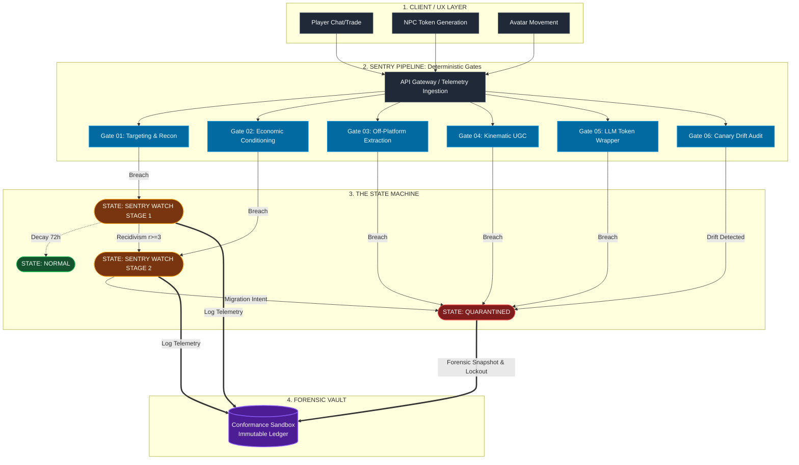

# Behavioral Governance & UGC Safety Architecture
**Transitioning Trust & Safety from Static Keyword Moderation to Deterministic Behavioral Sentry Gates**

---

## 1. Executive Thesis: The Structural & Legal Failure of Keyword Moderation

Static keyword filtering and decentralized, community-led reporting are structural, legal, and neurobiological failures. 

As evidenced by escalating Federal Trade Commission (FTC) complaints, state-level consumer protection lawsuits, and consolidated federal multidistrict litigation (**MDL 3166**) against platforms like Roblox and Discord, legacy moderation leaves user-generated content (UGC) economies fundamentally blind to how online exploitation operates.

In June 2026, state prosecutors explicitly targeted what legal filings define as a **"two-stage predatory pipeline"**:
*   **Stage 1:** Predators infiltrate unverified live-service ecosystems to build trust and exploit game mechanics.
*   **Stage 2:** Predators systematically force young users to migrate to encrypted, unmonitored platforms (Discord, Snapchat) before explicit harm occurs.

**The Operational Blind Spot:** Grooming is not an explicit, singular text event; it is a progressive, multi-stage **operant conditioning loop**. Predators systematically avoid explicit keywords until off-platform migration is complete. Platforms that rely on text-string regex or reactive user reports are mathematically incapable of detecting exploitation before liability is incurred.



---

## 2. The Threat Architecture: Neurobiology Meets Predatory Platform Design

Predatory behavior in live-service UGC platforms weaponizes two intersecting realities: **neurodevelopmental vulnerability** and **engagement-maximizing dark patterns**.

### The Neurobiological "Imbalance Model"
Developmental neuroscience demonstrates that during adolescence and emerging adulthood (ages 16–25), subcortical reward circuitry matures rapidly while the prefrontal cortex (**VLPFC**), responsible for impulse control and risk evaluation, develops gradually. 
*   **Cognitive Vulnerability:** Young users are biologically predisposed to sensation-seeking, FOMO, and compliance under social pressure.
*   **High-Risk Cohorts:** These risks are severely amplified in neurodivergent youth and individuals with Mild-to-Borderline Intellectual Disability (**MBID**), or Acquired Brain Injury (**ABI**), who display profound deficits in peer-resistance and risk awareness.  These same considerations apply across all age groups, not just youth.

### Weaponizing the Virtual Economy (Social Exchange Theory)
Predators exploit these biological imbalances through manipulative applications of **Social Exchange Theory**:
1.  **Cognitive Overload:** Platforms use layered virtual currencies (e.g., Robux) that obscure real-world financial value from developing brains.
2.  **Psychological Debt:** Predators use asymmetric in-game gifting, currency transfers, and gameplay assistance ("carrying") as love-bombing mechanisms.
3.  **Coerced Compliance:** The recipient develops a psychological debt of reciprocity, which the predator leverages to demand compliance, self-generated explicit material, or off-platform migration.

---

## 3. The Solution: Human-Centered Agentic Governance (HCAG) Deterministic Behavioral Sentry Gates

To eliminate the liability of the two-stage pipeline, platforms must replace subjective, reactive moderation with **Human-Centric & Conformance-Based Agentic Governance (HCAG)**—deploying non-bypassable, deterministic logic gates that intercept exploitation at the behavioral and economic layers.


```

[ STAGE 1: TARGETING ]          [ STAGE 2: CONDITIONING ]         [ STAGE 3: MIGRATION ]
Age/Authority Asymmetry   -->   Asymmetric Gifting / Favors -->   Obfuscated Routing Attempt
(Gate 1 Intercepts)               (Gate 2 Intercepts)               (Gate 3 Intercepts)

```

| Conformance Gate | Structural Trigger | Deterministic Action |
| :--- | :--- | :--- |
| **1. Gate 01: The Asymmetry & Velocity Gate** | An adult-profiled account (>18) initiates sustained, unreciprocated 1-on-1 interaction exclusively with `<13` cohorts across multiple distinct experiences. | Flags **structural cohort asymmetry** regardless of chat content; restricts direct messaging until peer-group baseline is restored. |
| **2. Gate 02: The Economic Reciprocity & Isolation Gate** | Asymmetric transfer of virtual currency or rare assets without fair-market in-game trade value, followed by an escalation in private messaging frequency. | Triggers a **Reciprocity Hold Gate**; temporarily suspends direct messaging and suppresses trade privileges to break the psychological debt loop. |
| **3. Gate 03: The Handoff & Migration Gate** | Repeated short alphanumeric patterns, phonetic spacing (`d i s c o r d`), or decal/image QR code sharing immediately following an economic gift or proximity flag. | Blocks communication channel; requires out-of-band verification and logs **off-platform routing intent** for automated forensic review. |

---

## 4. Conformance-Based Agentic Governance (CBAG) Extension: Governing AI-Generated Threats & Dynamic UGC

As generative AI accelerates the production of AI-generated child sexual abuse material (**AIG-CSAM**) and synthetic deepfakes, static asset hashing (e.g., PhotoDNA) is no longer sufficient. 

Through the **Conformance-Based Agentic Governance (CBAG)** sentry layer, this framework extends deterministic rules to dynamic and algorithmic actors:
*   **Dynamic Asset Chaining:** Prevents users from combining individually benign animations or emotes into emergent explicit behaviors in real time.
*   **Automated Sentry Auditing:** Intercepts LLM-driven NPCs or automated moderation drift before edge-case exploitation occurs in live production environments.

---

## 5. Repository Architecture

*   `docs/01_the_grooming_loop_autopsy.md`: Forensic breakdown of the Two-Stage Predatory Pipeline, dark patterns, and neurobiological exploitation.
*   `docs/02_hcag_conformance_gates.md`: Architectural specifications and operational parameters for the three Behavioral Sentry Gates.
*   `docs/03_cbag_ai_sentry_extension.md`: Sentry governance for dynamic UGC, generative AI threats, and automated moderation drift.
*   `schemas/behavioral_sentry_matrix.md`: Plain-text IF/THEN decision logic tables mapping inputs to deterministic system actions.
*   `schemas/ugc_safety_architecture.md`: Visual systems diagram of the behavioral interception loop.
*   `references/empirical_and_legal_basis.md`: APA-formatted research library of empirical neuroscience, legal filings, and FTC complaints supporting this architecture.

```
ts-behavioral-governance/
├── README.md                              <-- Executive Manifesto & Structural Failure Autopsy
│
├── docs/
│   ├── 01_the_grooming_loop_autopsy.md    <-- The Broken State (Why static T&S fails at conditioning)
│   ├── 02_hcag_conformance_gates.md       <-- The 3 Deterministic Gates (Asymmetry, Gifting, Migration)
│   └── 03_cbag_ai_sentry_extension.md     <-- Governing dynamic UGC AI & automated moderation drift
│
├── schemas/
│   ├── behavioral_sentry_matrix.md        <-- Plain-English rules, thresholds & CBAG state mutations
│   ├── sentry_rules.json                  <-- Executable JSON schema for backend runtime integration
│   ├── sentry_rules.csv                   <-- Tabular spreadsheet export for compliance & audit review
│   └── ugc_safety_architecture.md     <-- Process flowchart & visual architecture map
│
└── references/
    └── empirical_and_legal_basis.md       <-- Sources & Citations (FTC, MDL 3166, Neurobiology, Dark Patterns)

```
---
*Author: Tanya Gampert | Decision System Architect*  
*Framework: HCAG / CBAG Operational Governance*

---


