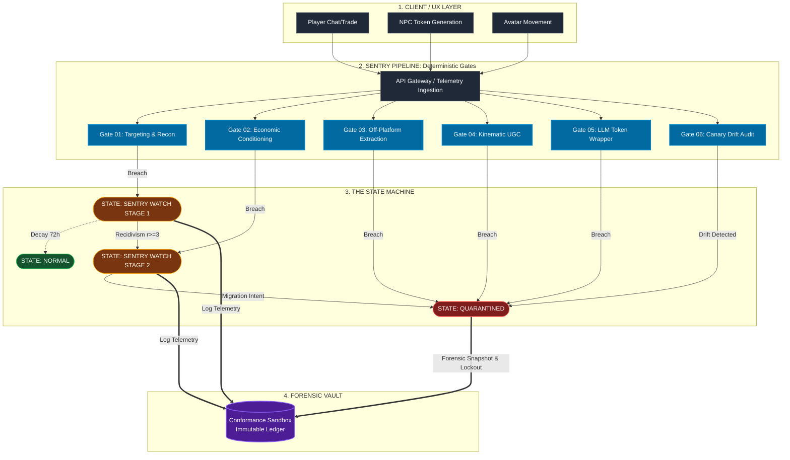

# Visual Architecture: The Execution Sequence

This diagram maps the real-time event pipeline, demonstrating how raw telemetry triggers deterministic state mutations before logging to the immutable forensic vault.

